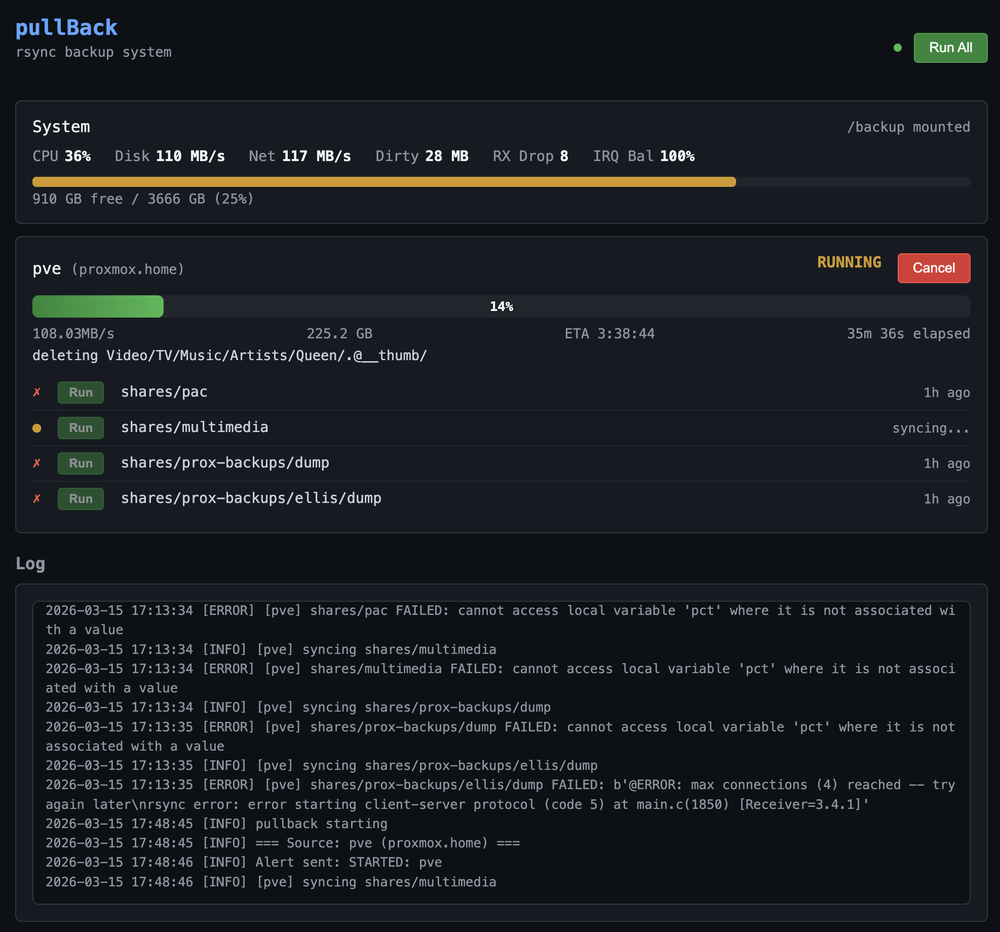

# pullBack

A dedicated rsync pull-backup appliance. Pulls incremental backups over SSH or rsync daemon from remote servers to USB drives. Built for Raspberry Pi but runs on any Linux box.

<p align="center">
  
</p>

## Why another backup solution?

Most backup tools push data from the source to the backup. pullBack does the opposite — it **pulls** from remote servers. This means:

- **The backup server controls the schedule**, not the source. No agents to install on production machines.
- **Read-only access** — the backup appliance only needs read access to the source. A compromised source can't delete backups.
- **Air-gapped by design** — unplug the USB drive and walk away. No cloud, no subscription, no vendor lock-in.
- **Ransomware detection** — fingerprint files and entropy analysis detect encryption before syncing.

## What makes it different?

- **Zero dependencies** — Python stdlib only (pyyaml is the sole pip dependency). No Docker, no database, no framework.
- **USB drive hot-swap** — plug in a drive, it's auto-detected and mounted. Flag file prevents accidental formatting of unknown drives.
- **Live web dashboard** — real-time progress, system stats (CPU, disk, network, dirty pages), per-folder sync control.
- **Performance tuned** — extensive kernel tuning for sustained transfers. Achieved **121 MB/s** on Raspberry Pi 4 (3.5x over untuned baseline).
- **Two transport modes** — SSH (encrypted, works anywhere) or rsync daemon (no encryption, gigabit wire speed on trusted LAN).
- **Retention management** — automatic pruning of old backup versions (pre-stamped vzdump and system-stamped hardlink modes).
- **Email alerts** — sync success/failure, ransomware warnings, disk space warnings via SMTP.

## Features

- Incremental rsync pull backups over SSH or rsync daemon
- Web dashboard with real-time progress and system monitoring
- **Terminal dashboard** (`cli.py watch`) — full interactive TUI with live stats
- CLI for manual sync, status, cancel, tuning
- Per-folder sync control from dashboard
- Per-folder `--delete` option (mirror mode)
- Ransomware detection (`.fprint` fingerprint files, entropy analysis)
- Backup retention management (vzdump pattern + hardlink-based versioning)
- USB drive auto-mount with flag file safety (never auto-formats)
- Email alerts (success, failure, ransomware warning, disk space, sync start)
- Configurable disk space warning threshold
- **Performance auto-tuning** with per-param sweep (disk, network, rsync layers)
- **Interactive tuning utility** (`tune-set.py`) — live parameter editor with sweep and monitor
- **Shared monitoring** (`monitor.py`) — rolling window averages used by dashboard, CLI, and engine
- Per-drive tuning via `.pullback-tune.yaml` on the backup volume
- Config overlay system (`config.yaml` → `config.local.yaml` → `.pullback-tune.yaml`)

## Quick Start

```bash
git clone https://github.com/pacmac/pullback.git
cd pullback/pullback/scripts

# Preview what setup will do
sudo bash setup.sh --dry-run

# Install
sudo bash setup.sh

# Pi-specific (captures system defaults for tuning baseline)
sudo bash pi-setup.sh
```

## Installation

### Any Linux host (x86/ARM)

```bash
git clone https://github.com/pacmac/pullback.git
cd pullback/pullback/scripts
sudo bash setup.sh
```

This will:
1. Create Python venv and install pyyaml
2. Generate SSH key in `keys/`
3. Create `config.local.yaml` from template
4. Install udev rule for USB auto-mount
5. Install and start web dashboard service

### Raspberry Pi

```bash
sudo bash pi-setup.sh
```

Runs the general setup above, then captures system defaults to `docs/TUNEDEFAULT.local.md` for tuning baseline. Does **not** apply tuning — that's done separately after testing.

### Post-install

1. Edit `pullback/config.local.yaml` with your SMTP credentials
2. Edit `pullback/config.yaml` with your sources
3. Copy SSH pubkey to remote host(s):
   ```bash
   ssh-copy-id -i pullback/keys/id_ed25519 root@YOUR_HOST
   ```
4. Connect a USB drive (auto-mounted if it has `.pullback-volume` flag file)
5. Initialise a new drive: `bash scripts/hd-init.sh /dev/sdX --format`
6. Dashboard: `http://<pi-ip>:8080/`

## Configuration

### config.yaml

Main configuration file (committed to git, no secrets).

```yaml
mount_point: /backup          # Where USB backup volume mounts
web_port: 8080
disk_warn_pct: 90             # Email alert when disk usage exceeds this %

sources:
  pve:
    host: proxmox.home
    remote_root: /data/
    transport: ssh              # "ssh" (default) or "rsync" (daemon, no encryption)
    rsync_module: backup        # Required when transport=rsync
    folders:
      - path: shares/documents
      - path: shares/media
        delete: true            # Mirror mode — delete files not on source
      - path: shares/backups/dump
        retention:
          pattern: "vzdump-*"
          extn_set: [.vma.zst, .log, .notes]
          keep: 3

rsync:
  args:
    - --archive
    - --numeric-ids
    - --partial
    - --whole-file
    - --inplace
    - --info=progress2,name1

ssh:
  key: keys/id_ed25519
  cipher: aes128-gcm@openssh.com  # Use aes128-ctr on Pi (no AES-NI)

email:
  enabled: true
  on_failure: true
  on_success: false
  on_warning: true
  on_start: true

ransomware:
  enabled: false
  sample_size: 30
  change_threshold: 0.30
  fprint_depth: 3

usb:
  flag_file: .pullback-volume
  filesystem: ext4
  reserved_pct: 1

tuning:
  dirty_ratio: 5
  dirty_background_ratio: 2
  dirty_expire_centisecs: 1000
  dirty_writeback_centisecs: 500
  bdi_max_bytes: 83886080    # Per-device dirty page cap (80 MB). 0 to disable.
  rps_enabled: true
  eee_off: true
  cpu_governor: performance
```

### config.local.yaml

Per-host overrides (gitignored, never committed). Created from `config.local.yaml.example` during setup. Merged on top of `config.yaml` using deep merge.

```yaml
email:
  smtp_host: your-smtp-host
  smtp_user: your-user
  smtp_pass: your-password
  from: pullback@yourdomain
  to: alerts@yourdomain

# Override tuning for this specific host
tuning:
  dirty_ratio: 5
  rps_enabled: false
  cpu_governor: ondemand

# Override transport
sources:
  pve:
    transport: rsync
    rsync_module: backup
    remote_root: /

# Override cipher for Pi
ssh:
  cipher: aes128-ctr
```

### Per-folder options

| Option | Default | Description |
|--------|---------|-------------|
| `path` | required | Remote folder path relative to `remote_root` |
| `delete` | `false` | Enable `--delete` to mirror source (removes files not on source) |
| `retention.pattern` | — | Glob pattern for pre-stamped files (e.g. vzdump) |
| `retention.extn_set` | — | File extensions to match for retention |
| `retention.keep` | — | Number of versions to keep |
| `retention.retain_stamp` | — | System-stamped retention with hardlinks |

## Transport Modes

### SSH (default)

Encrypted transfer over SSH. Works across any network.

```yaml
sources:
  myserver:
    host: server.example.com
    transport: ssh          # default, can be omitted
    remote_root: /data/
```

**Pi cipher tip:** Use `aes128-ctr` in `config.local.yaml` — 47% faster than `aes128-gcm` on Pi (no AES-NI hardware).

### Rsync daemon (no encryption)

Direct rsync protocol on port 873. No SSH overhead — reaches gigabit wire speed on trusted LAN.

```yaml
sources:
  myserver:
    host: server.local
    transport: rsync
    rsync_module: backup
    remote_root: /
```

Requires `rsyncd` on the source server. See [docs/RSYNCD.md](pullback/docs/RSYNCD.md) for setup.

## Performance Tuning

pullBack includes extensive tuning for sustained rsync transfers, particularly on Raspberry Pi 4.

### Measured results (Samsung SSD 870 4TB, Pi 4)

| Stage | Net | Improvement |
|-------|-----|-------------|
| Untuned baseline | 35 MB/s | — |
| + dirty_ratio=5 | 54 MB/s | +54% |
| + EEE disabled | 54 MB/s | prevents drops |
| + aes128-ctr cipher | 78 MB/s | +44% |
| + rsync daemon | **121 MB/s** | +55% |
| **Total** | **121 MB/s** | **3.5x baseline** |

### Tuning parameters

All tuning is defined in `config.yaml` and applied at sync start. No boot-time overrides — config.yaml is the single source of truth.

| Parameter | Default | Description |
|-----------|---------|-------------|
| `dirty_ratio` | 2 | % of RAM for dirty page hard limit |
| `dirty_background_ratio` | 1 | % of RAM to trigger background writeback |
| `dirty_expire_centisecs` | 100 | Age (cs) before dirty pages must be written |
| `dirty_writeback_centisecs` | 100 | Flusher thread wakeup interval (cs) |
| `bdi_strict_limit` | 0 | Per-device BDI enforcement (0=off, 1=on) |
| `bdi_max_bytes` | 0 | Per-device dirty page cap in bytes. 0 to disable |
| `rps_enabled` | true | Distribute network softirqs across CPUs (Pi) |
| `rps_cpus` | "c" | CPU mask for RPS (c = CPU2+3, f = all) |
| `eee_off` | true | Disable Energy Efficient Ethernet (Pi bcmgenet bug) |
| `cpu_governor` | performance | CPU frequency governor |
| `scheduler` | mq-deadline | I/O scheduler for backup device |
| `net_interface` | eth0 | Network interface for monitoring and RPS |
| `tcp_slow_start_after_idle` | 0 | Disable TCP slow start after idle |

**`bdi_max_bytes`** with `bdi_strict_limit=1` caps dirty pages per-device. The value must be less than the global dirty limit (set by `dirty_ratio`). For aggressive ratio settings (1-2%), this limits BDI to ~10-40MB.

### Per-drive tuning

Different drives need different tuning. Place a `.pullback-tune.yaml` file on the backup volume to override config.yaml defaults for that specific drive:

```yaml
# /backup/.pullback-tune.yaml — HDD example
tuning:
  bdi_max_bytes: 83886080  # 80 MB cap — essential for slow HDD
```

An SSD that keeps up with wire speed doesn't need BDI:

```yaml
# /backup/.pullback-tune.yaml — SSD example
tuning:
  bdi_max_bytes: 0  # no cap needed
```

Drive tuning is applied automatically at sync start. Use the tune-set utility to save settings to the drive.

See [TUNING.md](pullback/docs/TUNING.md) for full details.

### Interactive tuning

```bash
# Interactive parameter editor with live monitor and sweep
python3 scripts/tune-set.py

# CLI mode
python3 scripts/tune-set.py list                    # Show all params
python3 scripts/tune-set.py set dirty_ratio 2       # Set a param
python3 scripts/tune-set.py set bdi_max_bytes 40    # Set BDI (in MB)
python3 scripts/tune-set.py defaults                # Reset all to OS defaults
python3 scripts/tune-set.py monitor                 # Live stats monitor
python3 scripts/tune-set.py monitor 30              # Monitor for 30 seconds
python3 scripts/tune-set.py save                    # Save to state/tune-YYMMDD.yaml
python3 scripts/tune-set.py save-drive              # Save to /backup/.pullback-tune.yaml
python3 scripts/tune-set.py load <file>             # Load and apply from saved YAML
```

Interactive mode features:
- **Sweep mode**: Press `>` / `<` to step through value ranges with live monitoring
- **Live monitor**: Press `m` for avg/now speeds with colour coding (red <50, orange 50-80, green >80 MB/s)
- **Save/load**: Save snapshots, load previous configs, write to backup volume

### Auto-tuning

```bash
# Sweep disk params (BDI, dirty ratio, scheduler, etc.)
python3 cli.py tune autotune --layer=disk

# Sweep network params
python3 cli.py tune autotune --layer=network

# Preview without changes
python3 cli.py tune autotune --layer=disk --dry-run
```

Sweep ranges are defined in `config.yaml` under `autotune.disk`, `autotune.network`, `autotune.rsync`.

### Tuning docs

- [TUNING.md](pullback/docs/TUNING.md) — Parameter reference, rationale, procedure
- [TUNEDATA.md](pullback/docs/TUNEDATA.md) — Test results with before/after data

## Self-Backup (Disaster Recovery)

pullBack can image the entire SD card to the backup volume after each sync. If the SD card dies, write the image to a new card and boot.

### Config

```yaml
self_backup:
  enabled: true
  keep: 2          # Number of images to retain
```

### Manual run

```bash
sudo bash scripts/self-backup.sh
sudo bash scripts/self-backup.sh --keep=3
```

### Restore

1. Write a fresh Pi OS image to a new SD card and boot
2. Mount the backup USB drive
3. Restore:
```bash
rsync -aHAX /backup/.self-backup/rootfs/ /
rsync -aHAX /backup/.self-backup/boot/ /boot/firmware/
reboot
```

Uses filesystem rsync — only copies actual files (~4 GB), not empty space. First run takes seconds, subsequent runs are incremental (only changed files).

## USB Drive Management

### Flag file safety

Every pullBack volume has a `.pullback-volume` flag file on its root. The udev auto-mount script:

- **Flag file found** — mount the drive
- **No flag file** — refuse to mount, log instructions
- **Never auto-formats** — formatting only via `hd-init.sh --format` with interactive YES confirmation

### Initialise a new drive

```bash
sudo bash scripts/hd-init.sh /dev/sdX --format
```

### Swap drives

Unplug old drive, plug in new one. If it has a `.pullback-volume` flag file, it auto-mounts. If not, initialise it first.

## Web Dashboard

Real-time monitoring at `http://<host>:8080/`

- System stats: CPU, disk throughput, network throughput, dirty pages, RX drops, IRQ balance
- Per-source status with Run/Cancel buttons
- Per-folder sync buttons
- Live progress bar with speed, bytes transferred, elapsed time
- Disk usage bar with configurable warning threshold
- Log viewer

## CLI

```bash
cd pullback

# Sync
python3 cli.py sync                                   # Sync all sources
python3 cli.py sync --source pve                      # Sync one source
python3 cli.py sync --source pve --folder shares/pac  # Sync one folder
python3 cli.py status                                 # Show status
python3 cli.py cancel --source pve                    # Cancel running sync

# Terminal dashboard
python3 cli.py watch                                  # Live TUI (r=run, c=cancel, q=quit)

# Config
python3 cli.py config                                 # Show loaded config (JSON)
python3 cli.py config --dump                          # Show loaded config (YAML)

# Tuning
python3 cli.py tune status                            # Current tuning as YAML
python3 cli.py tune apply                             # Apply config tuning to system
python3 cli.py tune defaults                          # Revert all to OS defaults
python3 cli.py tune capture                           # Capture OS defaults to file
python3 cli.py tune autotune --layer=disk             # Sweep disk params
python3 cli.py tune autotune --layer=network          # Sweep network params
```

## Scripts

| Script | Description |
|--------|-------------|
| `setup.sh` | Full install (venv, SSH keys, udev, web service) |
| `pi-setup.sh` | General setup + capture system defaults |
| `pyenv-setup.sh` | Create Python venv and install pyyaml |
| `ssh-setup.sh` | Generate SSH key and configure access |
| `udev-install.sh` | Install udev rule and systemd mount service |
| `udev-mount.sh` | Called by udev on USB plug-in (mount or refuse) |
| `web-install.sh` | Install web dashboard systemd service |
| `hd-init.sh` | Initialise USB drive (format with confirmation) |
| `self-backup.sh` | Image SD card to backup volume |
| `tune-set.py` | Interactive tuning parameter editor with sweep and monitor |

## Project Structure

```
pullback/
  config.yaml              # Main config — SSOT (committed)
  config.local.yaml        # Per-host overrides (gitignored)
  config.local.yaml.example
  engine.py                # Sync orchestrator with flock guard
  sync.py                  # rsync wrapper
  config.py                # Config loader (config.yaml → local → drive tune)
  state.py                 # JSON state persistence
  cli.py                   # CLI: sync, status, cancel, watch, tune, config
  web.py                   # Web dashboard server
  monitor.py               # System monitor — SSOT for disk/net/dirty stats
  tuning.py                # Tuning — SSOT for param registry, apply, read
  alerts.py                # Email alerts
  ransomware.py            # Ransomware detection
  retention.py             # Backup version pruning
  scripts/                 # Setup scripts and tune-set utility
  static/                  # Dashboard HTML/CSS/JS
  udev/                    # udev rules and systemd service
  docs/                    # Specifications and test data
  keys/                    # SSH keys (gitignored)
  state/                   # Runtime state, monitor window (gitignored)
```

## License

MIT
